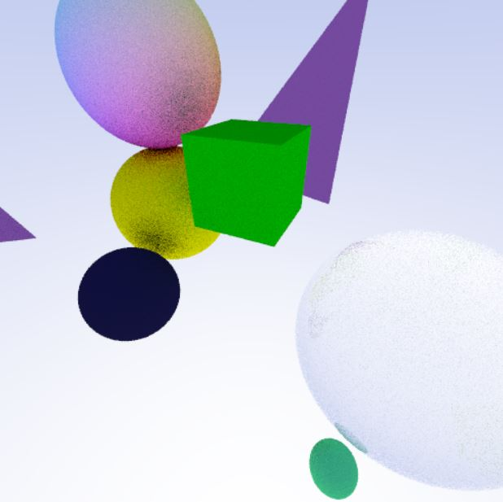

# RayTrace

This is an updated path tracer built from previous university coursework.
The old completed cw can be found in another [branch](https://github.com/ndrewfrost/RayTrace/tree/old_cw)

Current Progression:
Simple pixel tracer, return normal of one sphere

Next:
Tracing many objects
