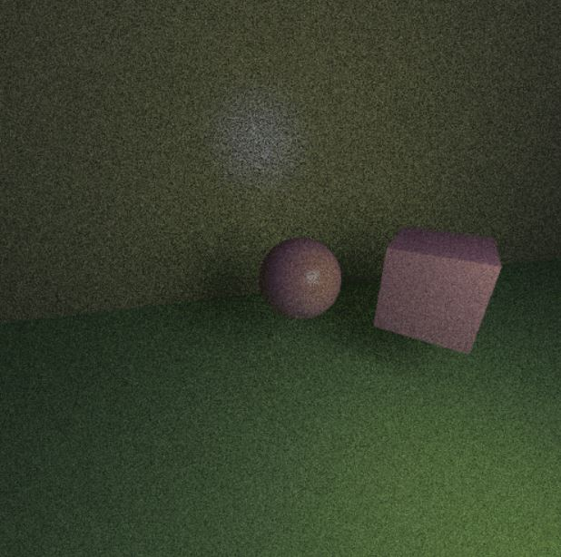

# RayTrace

This is an updated path tracer built from previous university coursework.
The old completed cw can be found in another [branch](https://github.com/ndrewfrost/RayTrace/tree/old_cw)

Current Progression:
Rendering Equation, basic materials, thin lens, basic shapes, lights, BVH

TODO:
advanced materials, extended sampling, TriMesh, light sampling, BssrDF, MLT

## Third-Party Dependencies

- [glm](https://github.com/g-truc/glm): OpenGL Mathematics

- [SDL](https://www.libsdl.org/)
